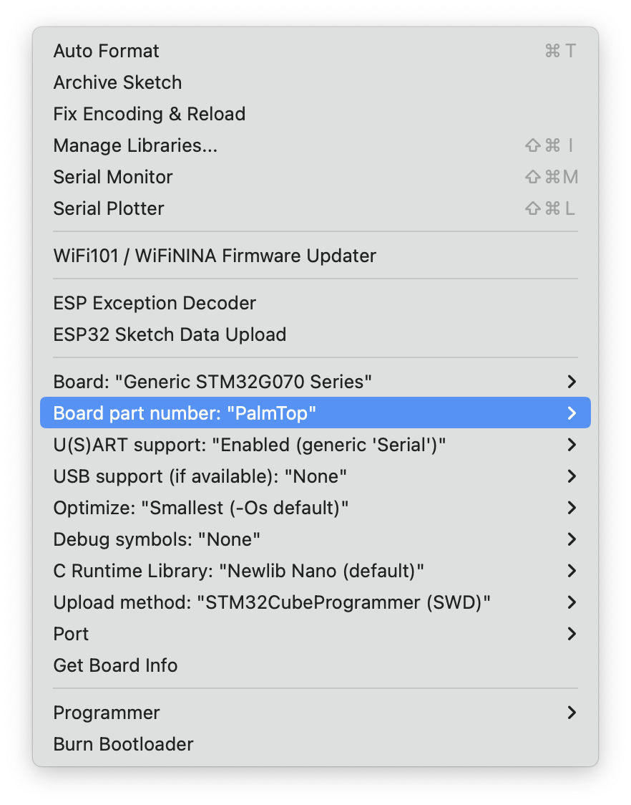

# Custom STM32G070 Board supports for Arduino IDE

This repo contains custom board configuration for 
 * TechStudio G070 Boards
 * [PalmTop](https://github.com/e-tinkers/palmtop) board 

on Arudino IDE based on ST Microelectronics' official [Arduino Core STM32](https://github.com/stm32duino/Arduino_Core_STM32).

The Generic variants for G070KBT/G070CBT has been part of the Arduino Core STM32 releasee version 2.3.0 as per my [Pull Request](https://github.com/stm32duino/Arduino_Core_STM32/pull/1638) and is officially roll-in as part of the release 2.4.0.  However, for my own projects, such as [Palmtop](https://www.e-tinkers.com/2023/06/build-a-palmtop-handheld-with-stm32g070)), it is not appropriate to do a pull request to add the board support that no one is going to use execpt only me, therefore, this repository is add the my personal custom boards to the Arduino IDE.

**Update:** The core of the STM32 Arduino has been updated from v2.2.0 to v2.10.1 in 29 Aug, 2025.

## Installation

- In order to use the custom board setting, you must have the STM32duino Arduino Core installed, if you don't have it installed yet, please follow the [Getting Started](https://github.com/stm32duino/wiki/wiki/Getting-Started) instructions to install the Arduino Core.

- Quit the Arduino IDE.

- Clone this github into your Arduino hardware environment by creating a **hardware** directory. The custom board configuation requires to be placed in `$HOME/Arduino/hardware` directory.

```
    $ mkdir -p $HOME/Arduino/hardware
    $ cd $HOME/Arduino/hardware
    $ git clone https://github.com/e-tinkers/variants.git variants
```

## Configuration

Launch Arduino IDE, and select the board from **Tools -> Boards -> STM32G070xx Custom Boards**. Make sure that you choose the correct board part number, upload method, etc., and you are ready to go.


